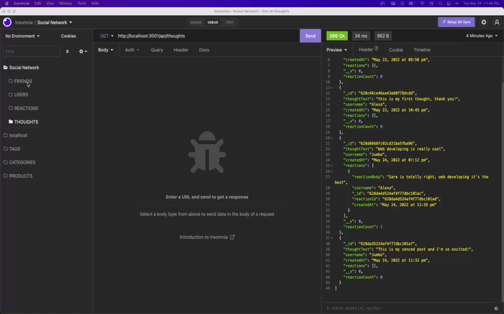

# social-network
API for a social network web application where users can share their thoughts, react to friends’ thoughts, and create a friend list. This API uses **Express.js** for routing, a **MongoDB** database, and the **Mongoose** ODM.


## Functionality 

```md
GIVEN a social network API
WHEN entering the command to invoke the application
THE server is started and the Mongoose models are synced to the MongoDB database
WHEN the API GET routes in Insomnia for users and thoughts
THEN the data for each of these routes is displayed in a formatted JSON
WHEN testing API POST, PUT, and DELETE routes in Insomnia
THEN it creates, updates, and deletes users and thoughts in the database
WHEN testing API POST and DELETE routes in Insomnia
THEN it creates and deletes reactions to thoughts and add and remove friends to a user’s friend list
```

## Mock-Up

**Walkthrough video** starting application & User's routes.

[


**Walkthrough video** demonstrating thoughts's routes

[


**Walkthrough video** demonstrating Friend's routes

[


**Walkthrough video** demonstrating Reaction's routes

[

## Deployment 🚀

| Description   | URL's                                                                               |
| ------------- | -------------                                                                       |
| Video         | https://drive.google.com/drive/folders/1PPBq4HS-y-S1IuiVTeRPi2gctdL54pxA?usp=sharing|
| Repository    | https://github.com/efrech/social-network                                            |
